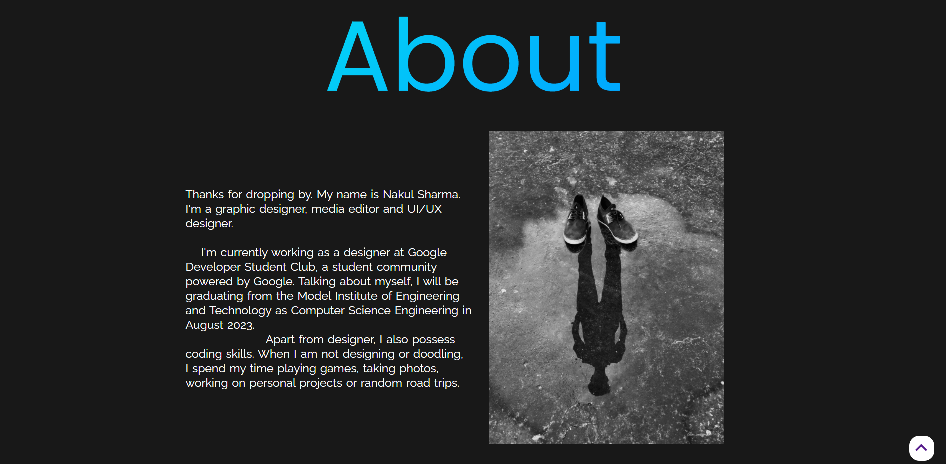
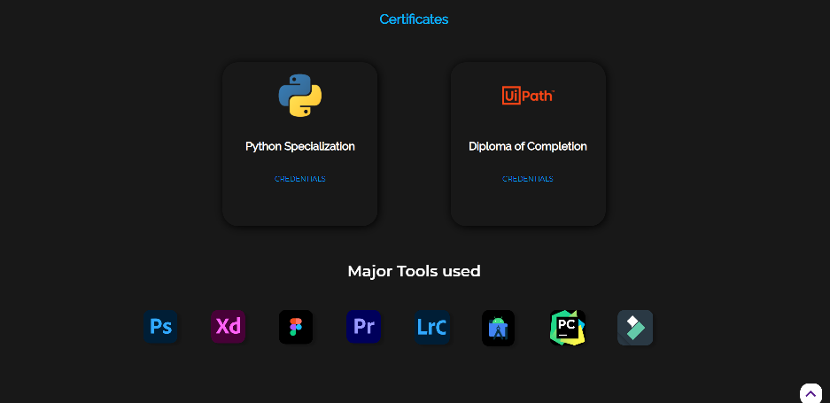

# Portfolio

## This repository holds the webpages of Portfolio

<h1 align="center" style="padding:2rem"> 👀 LANDING PAGE </h1>

<h1 align="center" style="padding:2rem"> 🙄 ABOUT ME ? </h1>

<h1 align="center" style="padding:2rem">  😎 Experience So far ! </h1>

<h1 align="center" style="padding:2rem"> ✨ BACKGROUND ? </h1>

<h1 align="center" style="padding:2rem"> 🎈 CERTIFICATIONS ! </h1>

<h1 align="center" style="padding:2rem"> ✉ Let's Have a chat ! </h1>

